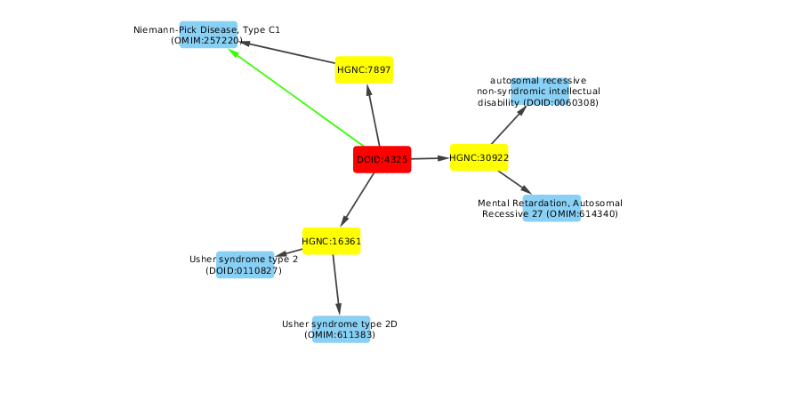

# PROTOKOP
Prototype implementation of building a knowledge network by iteratively querying data sources.

## Introduction

The purpose of this tool is to rapidly test the efficacy of an edge-crawling technique to produce knowledge graphs.

Suppose that you have a knowledge graph in something like neo4j.  You can write a query that specifies a path through the data where each node has certain properties or types.  Now suppose, however that your nodes are not in a single database, but are in a series of federated systems with interfaces that allow subject-object queries.

We still want to run the same kinds of queries, but we are going to operate at the single-edge level,
somewhat similar to [Linked DataFragments](http://linkeddatafragments.org/concept/).   We read in a path query and
decompose it into a set of binary queries that can be sent to a known set of data sources.

Beyond this, we add the creation of supporting edges: for each pair of nodes along a result path, we query Chemotext, a Pubmed term co-occurrence database.  When terms co-occur in PubMed papers, we add edges between those terms in the path, indicating support for the path.

## Example

One potential query is "Find a genetic condition that may be protective against infection from the Ebola virus."   How could there be such a condition?  If there a particular human gene is needed for the Ebola virus to infect its host, then a genetic condition that degrades the performance of that gene may also offer protection against infection.  Therefore, we can interpret this in the following way:  "Find a path starting at Ebola Virus, going through a target, and then going to a node for an (unknown) genetic condition".

Our query can be schematically represented as: "(D;DOID:4325)-G-GC".  Each dash represents an edge, and the nodes are specified by their type. Here "G" stands for "Gene", "GC" is "Genetic Condition" and "D" is disease.  In addition, the first node in the query is specified by the ID for Ebola infection in the Disease Ontology, DOID:4325.

PROTOKOP begins at its given node "DOID:4325", and queries its known data sources (in this case Pharos) for genes that are connected to that disease.  It then takes each of these genes and queries its data sources (here Biolink) to look for genetic conditions that are associated with that gene.

Once the graph is built and pruned, chemotext is queried to look for supporting edges.  In this case, one supporting edge is found connecting DOID:4325 (Ebola infection) with DOID:14504 (Niemann-Pick disease). 

In this image, the source node is displayed in red, the genes from the first query are in yellow, and the genetic conditions from the second query are in blue.  Edges from those queries are in black, and the edge for the support query is in green.

## Implementation

The tool can be kicked off with `python builder.py` and will run the Ebola example given above.  The doid at the starting point can be changed in the `main()` function.  

The structure of the query can also be changed there.  Allowed types are listed in the docstring for KnowledgeGraph.  However, at the moment, only a couple of query types are actually mapped to a data source.

Queries are sent from the KnowledgeGraph to the WorldGraph.  WorldGraph is meant to be a uniform interface to the various data sources in the world.   WorldGraph knows how to route particular types of queries (such as disease to gene) to a particular function in a particular package and return the result.   This is much the same functionality as some other packages such as greent, and the idea is that WorldGraph would eventually be replaced with greent or an NCATS beacon.

Results are exported in a json file and a graphml version (the graphml can be read into cytoscape).
